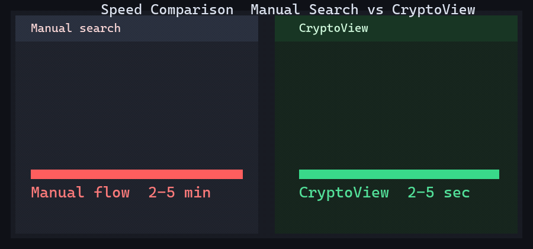
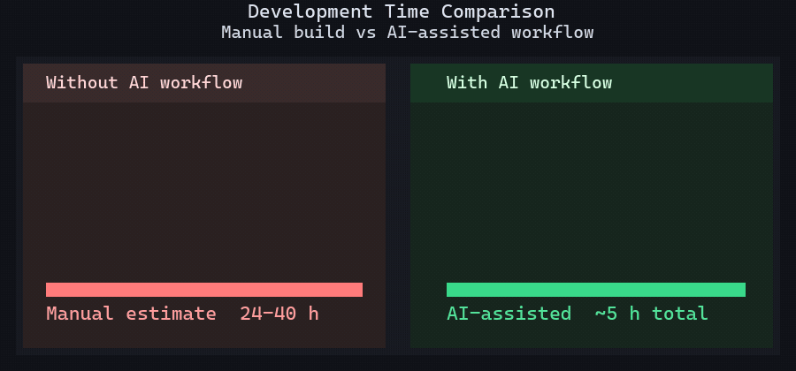
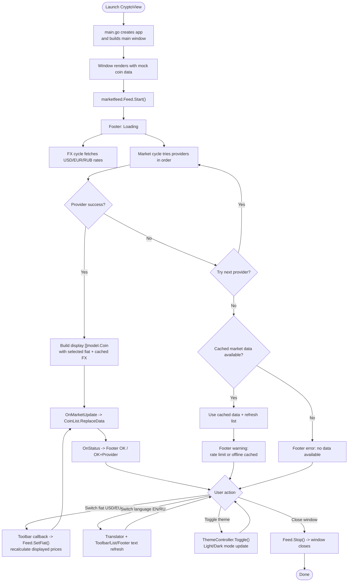
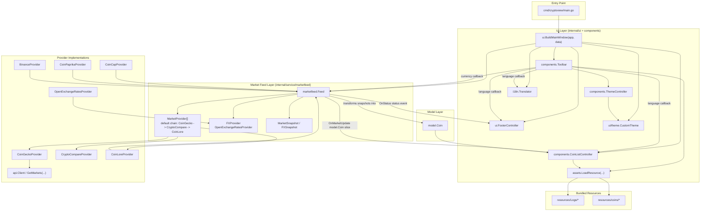

# Crypto View - Testing contextual engineering

<p align="left">
  
</p>

[](https://golang.org)
[](https://fyne.io)
[]()
[]()

**CryptoView** is a compact desktop crypto price viewer built with **Go + Fyne**.
It focuses on quick crypto-to-fiat checks with **live updates**, **provider fallback**, **cached data behavior**, and a clean **light/dark UI**.

This is also an **educational AI-assisted development project**: beyond the app itself, a major goal was to explore how far a structured AI workflow can accelerate delivery when the project has strong guidance artifacts (`AGENTS.md`, `.cursor/rules/*`, and supporting docs).

## The Problem & The Fix

Checking crypto prices manually is usually a small task that turns into a noisy workflow:
open multiple websites, search coin names, compare values, convert to fiat, repeat.
Add API hiccups or rate limits, and the flow becomes even slower.

**CryptoView** turns that into a single glance-friendly desktop window:

- live price polling for tracked coins
- fiat switching (`USD`, `EUR`, `RUB`)
- language switching (`EN`, `RU`)
- source status feedback in the footer
- provider fallback + cached data warnings when network/API issues happen

| Before CryptoView                              | After CryptoView                                   |
| ---------------------------------------------- | -------------------------------------------------- |
| Multiple tabs/exchanges and manual search      | One compact desktop window with tracked coins      |
| Manual crypto-to-fiat conversion checks        | Instant fiat switch (`USD/EUR/RUB`)              |
| No clear source health / rate-limit visibility | Footer status shows loading / OK / warning / error |
| Broken flow when one API fails                 | Fallback providers + cached snapshot behavior      |

## ⏳ Speed Comparison



**Illustrative UX estimate (not a benchmark):**

- Manual check across websites + fiat conversion: **~2-5 minutes**
- Quick check in CryptoView (open app + switch fiat): **~2-5 seconds**
- Fewer tabs, less context switching, clearer status when providers fail

> Note: Time varies by network speed, API availability, and user workflow. These numbers are visual UX estimates for README storytelling.

## Why CryptoView Is Useful

- **Live Market Updates:** Polling-based updates refresh the tracked coins list automatically.
- **Provider Fallback Chain:** If one provider fails or rate limits, the app can continue via alternative sources.
- **Offline / Cached Behavior:** Cached market data can still be shown with warning status when live fetch fails.
- **Fiat Conversion:** Switch between `USD`, `EUR`, and `RUB` in the toolbar.
- **Language Switch:** UI text supports `EN` and `RU`.
- **Theme Toggle:** Light and dark modes with a custom palette tuned for readability.
- **Status Footer:** Clear feedback for loading, OK, warning, and error states.
- **Glance-First Layout:** Fixed-size compact window designed for quick checking.
- **Local Assets:** Coin icons and app branding are bundled with the app resources.

## Project Highlights

- **Real UI + Real Data Flow:** Desktop GUI, network providers, fallback logic, and status handling in one project.
- **Resilience-Oriented Feed:** Cooldowns, retry windows, fallback providers, and cached snapshots improve usability.
- **Clean Separation of Concerns:** UI controllers, model types, market feed orchestration, providers, i18n, and theme code are clearly split.
- **Tested Modules:** The repository includes tests for API/client behavior, feed fallback logic, i18n, UI components, footer states, and custom theme behavior.
- **AI-Workflow Experiment:** The project is intentionally interesting not only as an app, but also as a documented example of rule-driven AI-assisted development.

## AI-Assisted Development Context

CryptoView is a **working desktop app**, but it is also a **study project** about effective AI usage in development.

The idea was to validate a workflow where speed comes not only from the model itself, but from:

- explicit agent instructions in `AGENTS.md`
- project-specific rules in `.cursor/rules/*`
- structured docs/context artifacts (including packed repo context via repomix)
- iterative human review + targeted corrections

In other words: the app matters, but the **process assets** (rules, agent instructions, workflow discipline) are a core part of the outcome and a big reason the iteration speed is high.

### ⏱️ Development Time Comparison (Illustrative)



For this scope (app + UI polish + tests/docs + README assets):

- **With AI-assisted workflow (including setup and prompting): ~5 hours total**
- **Manual solo implementation estimate: ~24-40 hours (~3-5 working days)**

> Estimate note: this is an approximate comparison for a competent solo developer building and polishing a similar result manually. Actual time depends on experience with Go/Fyne, API integration speed, and documentation standards.

## Technical Details

- **Stack:** Go 1.22 + Fyne (`fyne.io/fyne/v2`)
- **UI Composition:** `ui.BuildMainWindow(...)` wires toolbar, coin list, footer, translator, and market feed callbacks.
- **Feed Orchestration:** `marketfeed.Feed` runs market polling + FX polling, applies provider cooldowns, and emits status/market updates.
- **Fallback Behavior:** Providers can fail independently (network / rate-limit / other), with warning or error status mapped to UX.
- **FX Conversion:** `OpenExchangeRatesProvider` updates rates so displayed coin prices can switch fiat instantly.
- **Thread-Safe UI Updates:** UI refreshes are marshaled via `fyne.Do(...)`.
- **Localization:** Translator-based string lookup with EN fallback.
- **Theme System:** Custom light/dark palette layered on top of Fyne default theme.

## Build Instructions

### Requirements

- Go **1.22+**
- Fyne dependencies for your OS (desktop build prerequisites)
- `make` (optional, only if you use the `Makefile`)
- PowerShell (for `build.ps1` / `build_all_os.ps1` on Windows)

### Quick Run

```bash
go run ./cmd/cryptoview
```

### Build With Makefile

```bash
# Build local binary
make build

# Run directly
make run

# Build cross-platform targets (Windows/Linux/macOS)
make build-all
```

### Build on Windows (PowerShell, app icon included)

```powershell
.\build.ps1
```

Notes:

- The script builds `bin/cryptoview.exe`
- It converts `resources/Logo/CryptoView Icon.png` into a temporary `.ico`
- It auto-installs `github.com/akavel/rsrc` if missing to embed the Windows icon resource

### Cross-Platform Build (PowerShell)

```powershell
.\build_all_os.ps1
```

Notes:

- Builds Windows / Linux targets in `bin/`
- macOS build may be skipped on a Windows host because Fyne macOS builds require CGO + a macOS cross-toolchain (`osxcross/clang`)

## Feature Tour

### Main Window (Dark Theme)

<p align="center">
  
</p>

Dark UI with:

- top toolbar (`currency`, `language`, `theme toggle`)
- tracked coin rows (`ticker`, `name`, `price`, `24h change`, `update time`)
- footer status with provider/source feedback

### Main Window (Light Theme)

<p align="center">
  
</p>

Same workflow and layout with a brighter palette for day-time readability.

## User Journey Flow



## Architecture / Class Interaction Diagram



## Testing

Run the full test suite:

```bash
go test ./...
```

The repository includes tests around:

- `internal/api` (client/API behavior)
- `internal/model` (coin mapping and formatting helpers)
- `internal/service/marketfeed` (fallback, cooldown, cached data behavior)
- `internal/ui/components` (toolbar and coin list interactions)
- `internal/ui/theme` (custom theme palette behavior)
- `internal/ui/i18n` (translations and formatting)
- `internal/ui` footer/controller behavior

## Project Notes

- This is a **learning / portfolio-quality desktop app** that demonstrates Go + Fyne UI work, provider integration, and resilience-oriented update flows.
- It is also a **workflow experiment in AI-assisted engineering**, where `AGENTS.md` + `.cursor/rules/*` are intentionally part of the project's value.
- **Not financial advice.** CryptoView is an informational viewer for quick price checks.

---

Built with Go and Fyne for fast desktop crypto price checks.
